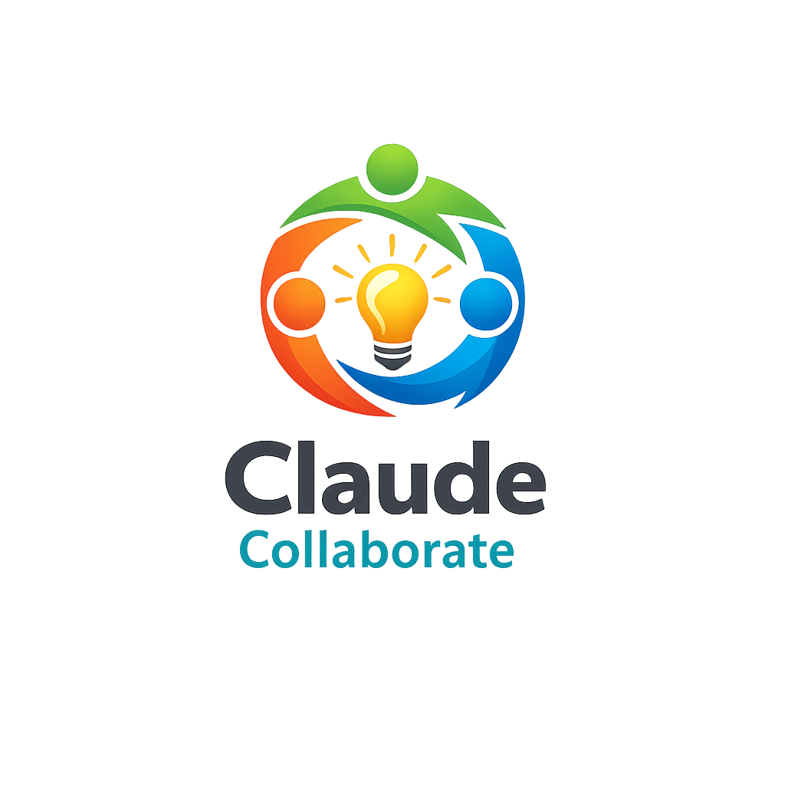

<p align="center">
  <a href="README.md">English</a> | <a href="README.ja.md">日本語</a> | <a href="README.zh.md">中文</a> | <a href="README.es.md">Español</a> | <a href="README.fr.md">Français</a> | <a href="README.hi.md">हिन्दी</a> | <a href="README.it.md">Italiano</a> | <a href="README.pt-BR.md">Português (BR)</a>
</p>

<p align="center">
  
</p>

<p align="center">
  <a href="https://github.com/mcp-tool-shop-org/claude-collaborate/actions/workflows/ci.yml"></a>
  <a href="LICENSE"></a>
  <a href="https://mcp-tool-shop-org.github.io/claude-collaborate/"></a>
</p>

> *Onde a criatividade humana encontra a inteligência artificial*

Claude Collaborate é um ambiente de sandbox unificado para colaboração em tempo real entre humanos e IA. Ele reúne espaços de trabalho interativos, comunicação perfeita e ferramentas criativas em uma interface elegante.

## ✨ A Visão

Imagine um espaço de trabalho onde você pode:
- **Desenhar e fazer brainstorming** em uma lousa compartilhada
- **Escrever código juntos** com visualização instantânea
- **Jogar xadrez** e discutir estratégias
- **Criar conteúdo** com ferramentas prontas para o GitHub
- **Comunicar em tempo real** através de uma ponte WebSocket

Tudo em um só lugar. Tudo perfeitamente integrado.

## 🚀 Início Rápido

```bash
# Clone the repository
git clone https://github.com/mcp-tool-shop-org/claude-collaborate.git
cd claude-collaborate

# Install dependencies
pip install aiohttp

# Start the server
python server.py

# Open in browser
# http://localhost:8877
```

## 🎨 Ambientes

| Ambiente | Descrição |
| ------------- | ------------- |
| **Whiteboard** | Desenhe, esboce e faça brainstorming visualmente |
| **Code Workshop** | Editor HTML/CSS/JS com visualização em tempo real |
| **Chess Workshop** | Ambiente para testar estratégias e táticas |
| **Capture Viewer** | Visualizador de capturas de tela e gravações |
| **GitHub Toolkit** | Geradores de README e materiais de marketing |
| **Creative Lab** | Experimentos interativos |
| **Template** | Modelo para criar novos ambientes |

## 🏗️ Arquitetura

```
claude-collaborate/
├── index.html           # Main UI with environment switcher
├── server.py            # aiohttp server
├── ws_bridge.py         # WebSocket bridge for Claude Code
├── whiteboard.html      # Drawing and brainstorming
├── code-playground.html # Live HTML/CSS/JS editor
├── chess.html           # Chess analysis board
├── capture-viewer.html  # Screenshot/recording viewer
├── github-toolkit.html  # README and marketing tools
├── template.html        # Starter for new environments
└── adventures/          # Creative Lab experiments
    └── index.html
```

## 🔌 Protocolo WebSocket

Claude Collaborate inclui uma ponte WebSocket para comunicação em tempo real com Claude Code:

```javascript
// Browser sends to Claude
{ "type": "user_message", "content": "Hello!" }

// Claude responds
{ "type": "claude_response", "content": "Hi there!" }

// Connection status
{ "type": "connected", "message": "Connected to Claude Collaborate Bridge" }
```

## 🔗 Pontos de Extremidade da API

| Ponto de Extremidade | Método | Descrição |
| ---------- | -------- | ------------- |
| `/` | GET | Interface de usuário principal do Claude Collaborate |
| `/{file}` | GET | Arquivos estáticos (lousa, etc.) |
| `/ws` | WS | Ponte WebSocket |
| `/api/ws/messages` | GET | Ler mensagens pendentes do usuário |
| `/api/ws/respond` | POST | Enviar resposta para o navegador |
| `/api/ws/status` | GET | Status da ponte WebSocket |
| `/health` | GET | Verificação de saúde do servidor |

## 💬 Para Usuários do Claude Code

Integre-se com o Claude Collaborate através da ponte WebSocket:

```bash
# Read messages from the UI
curl http://localhost:8877/api/ws/messages

# Send a response back
curl -X POST http://localhost:8877/api/ws/respond \
  -H "Content-Type: application/json" \
  -d '{"content": "Hello from Claude!"}'
```

## 🎭 Opcional: Integração de Voz

Claude Collaborate funciona perfeitamente com [Voice Soundboard](https://github.com/mcp-tool-shop-org/voice-soundboard) para TTS:

```bash
# In another terminal, start Voice Soundboard
cd voice-soundboard
python -m voice_soundboard.web_server

# Voice Studio will be available at http://localhost:8080/studio
```

## 🛠️ Criando Novos Ambientes

1. Copie `template.html` para `your-environment.html`
2. Adicione-o à barra lateral em `index.html`:
```html
<div class="env-item" data-url="/your-environment.html" data-name="Your Environment">
    <div class="env-icon" style="background: linear-gradient(...);">🎯</div>
    <div class="env-info">
        <h3>Your Environment</h3>
        <p>Description</p>
    </div>
</div>
```
3. Atualize a página e comece a criar!

## 📋 Requisitos

- Python 3.10+
- aiohttp
- Navegador moderno com suporte a WebSocket

## 🤝 Contribuições

Aceitamos contribuições! Seja:
- Modelos de ambiente
- Melhorias de UI/UX
- Correções de bugs
- Documentação

Por favor, abra um problema ou envie um pull request.

## 📄 Licença

Licença MIT - Veja [LICENSE](LICENSE) para detalhes.

## 🙏 Agradecimentos

- **Anthropic** - Pela Claude e pela visão de uma IA útil
- **A Comunidade** - Por expandir os limites da colaboração entre humanos e IA

---

<p align="center">
  <i>Built with ❤️ for the future of collaboration</i><br>
  <a href="https://github.com/mcp-tool-shop-org">MCP Tool Shop</a>
</p>
